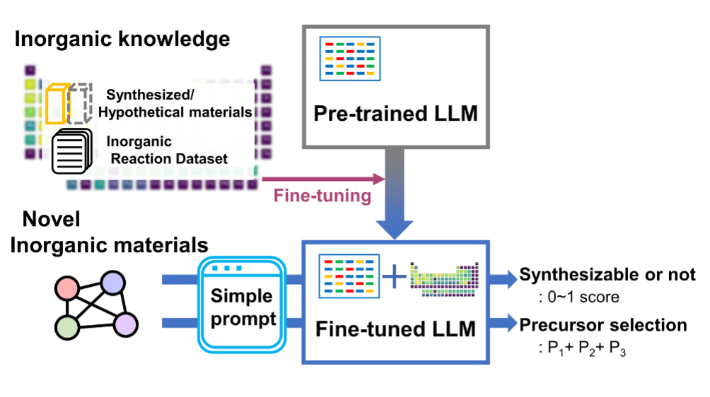

# SynthGPT

This repository contains the data and code for [Large Language Models for Inorganic Synthesis Predictions](https://pubs.acs.org/doi/full/10.1021/jacs.4c05840) by [Seongmin Kim](https://scholar.google.com/citations?user=HXcbuWQAAAAJ&hl=en&oi=ao), [Yousung Jung](https://scholar.google.com/citations?user=y8D-JCAAAAAJ&hl=en&oi=ao), and [Joshua Schrier](https://scholar.google.com/citations?user=zJC_7roAAAAJ&hl=en).

# Organization

**Input data** and pre-defined training and cross-validation and train/test splits are found in the `data_MP` and `data` folders, for the synthesizability and precursor selection tasks, respectively.

**Results** are in the `results_MP` and `results` folders, for the synthesizability and precursor selection tasks, respectively.  We have used a JSON format to facilitate interpretation of the results.

**Prompts** for the LLM are in the `prompts` folder as plain text files;  they can also be found in the online Supporting Information file.

**Source code** is in the `src` folder; some haphazard tests are included in `tests`.

# Instructions

Run the notebooks in the top-level directory in order.  Mathematica code (`.wls`) uses Mathematica 14.0 and no other libraries.  Python code (`.py`) uses python 3.8.13 and requires libraries; Numpy (version == 1.22.3), PyTorch (version == 1.11.0), and Pymatgen (version == 2022.9.21).

The directory is organized around the order in which we performed the work, dividing the work into discrete tasks:  
 - Precursor selection  (scripts `00_Data_Curation.py` - `07_Estimate_Perfect_Elemwise.py`) 
- Synthesizability prediction (`08_Data_Preparation_Synthesizability.wls` - `11_Score_GPT_Outputs_Synthesizability.wls`)
- Evaluation of precursor rescoring results with GPT-4 (`12a_SetupData_Combined.wls` and `12b_Evaluate_Combined.wls` ) and by removing recommendations that do not consist of only allowed precursors (`13_Precursor_Compliance.wls` and `14_Evaluate_Combination_Retaining_Only_Allowed_Precursors.wls`)
- Evaluation of the effects of prompt modification on the synthesizability prediction.  These are each evaluated for only the first 5000 test items. They include modifying the prompt to add additional specialization ("You are an expert **oxide** inorganic chemist...",  `15a_Prompt_Modification_Oxide.wls`), removing specialization ("You are a **magician**..." `15b_Prompt_Modification_Magician.wls`), and alternate ways of expressing the positive-unlabelled training task ("...items labeled \"U\" could be positive or negative (i.e., synthesizable or unsynthesizable"), `15c_Prompt_Modification_Labeling.wls`).  

Yes, this is different from the order the paper.  "Life can only be understood backwards; but it must be lived forwards." --[Søren Kierkegaard](https://en.wikipedia.org/wiki/Søren_Kierkegaard) 

# Cite

A publication appears on the [Journal of the American Chemical Society](https://pubs.acs.org/doi/full/10.1021/jacs.4c05840) as `doi:10.1021/jacs.4c05840`  

